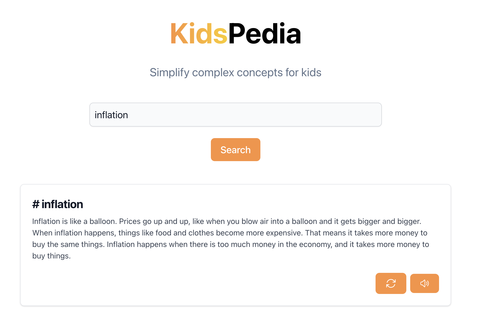

# KidsPedia

**KidsPedia** is an online encyclopedia for kids. Leveraging on the ChatGPT technology of OpenAI, KidsPedia provides simple and easy-to-understand answers with metaphors to kids’ questions. From apples to theory of relativity, KidsPedia explains them all! To enhance searching experiences, KidsPedia includes a read-out function to read out the answers to kids' questions. To fasten the search process, KidsPedia also stores search records in a database.